# Design Patterns Implementation Plan - Tuan3

Xây dựng hệ thống áp dụng các Design Patterns cho bài tập tuần 3 môn Kiến trúc Thiết kế Phần mềm.

---

## Proposed Changes

### Problem 1: Composite Design Pattern

> **Bài toán**: Quản lý thư mục/tập tin theo mô hình cây và các thành phần UI (nút bấm, hộp thoại, thanh điều hướng).

#### UML Diagram - File System

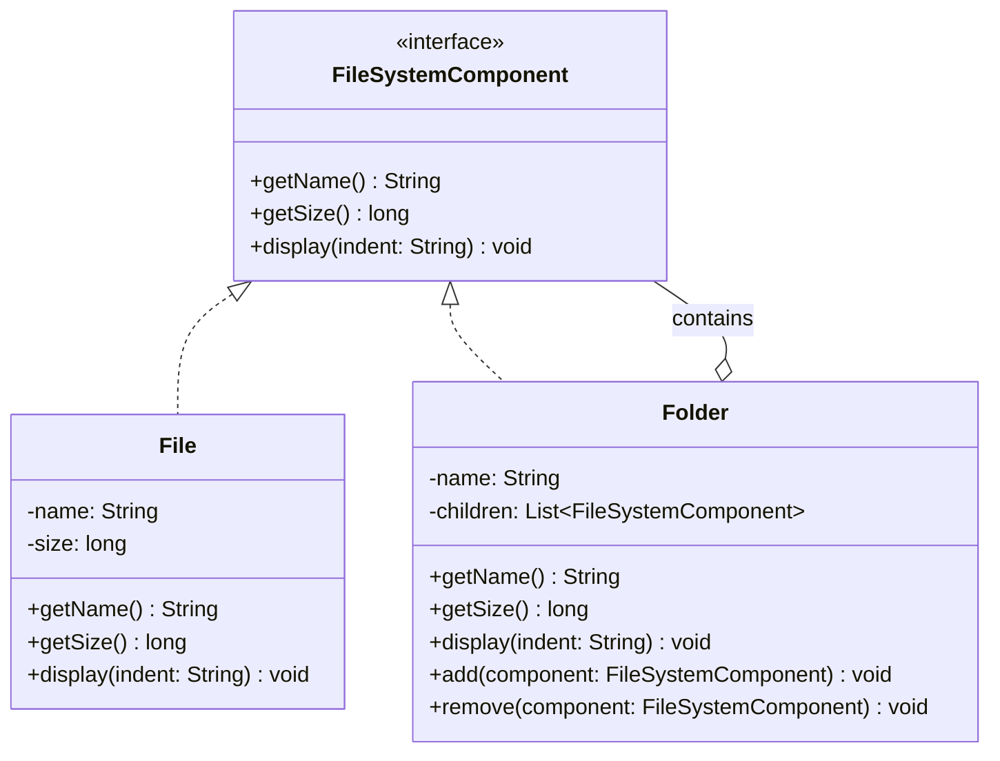

#### UML Diagram - UI Components

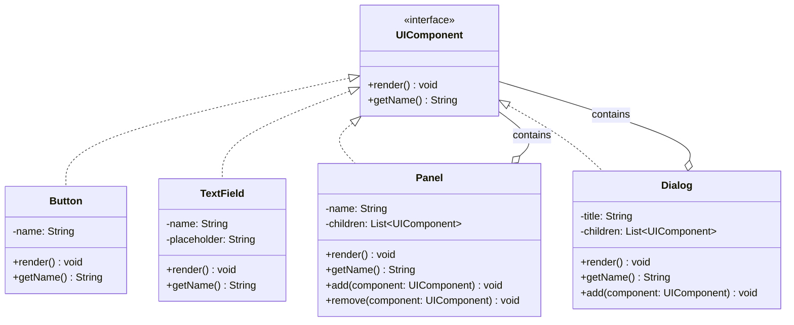

#### Files Structure

```
Tuan3/
└── Problem1_Composite/
    ├── filesystem/
    │   ├── FileSystemComponent.java
    │   ├── File.java
    │   └── Folder.java
    ├── ui/
    │   ├── UIComponent.java
    │   ├── Button.java
    │   ├── TextField.java
    │   ├── Panel.java
    │   └── Dialog.java
    └── CompositeDemo.java
```

---

### Problem 2: Observer Design Pattern

> **Bài toán 1**: Thông báo cho nhà đầu tư khi giá cổ phiếu thay đổi.  
> **Bài toán 2**: Thông báo cho thành viên nhóm khi trạng thái công việc thay đổi.

#### UML Diagram - Stock Observer

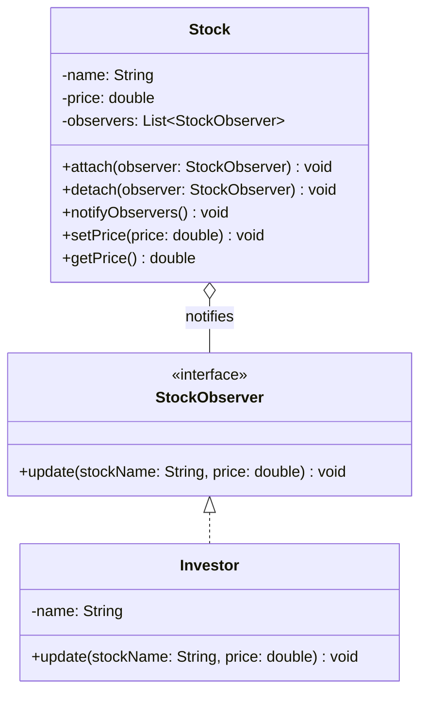

#### UML Diagram - Task Observer

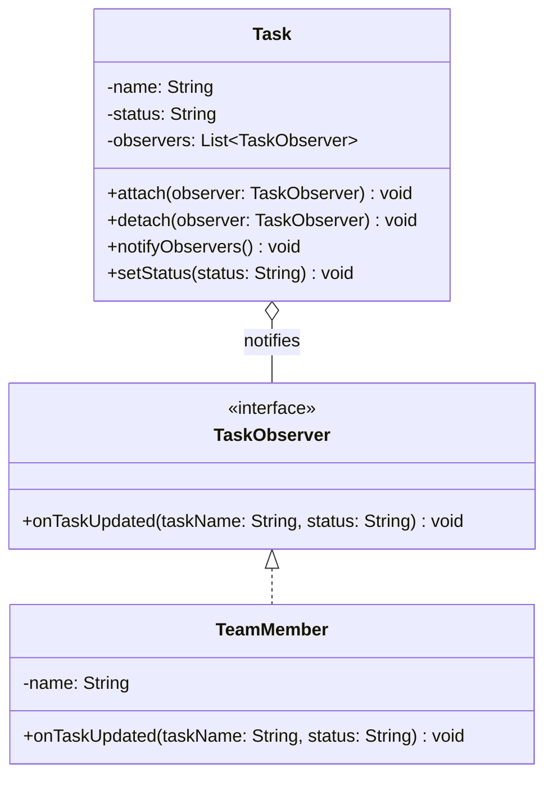

#### Files Structure

```
Tuan3/
└── Problem2_Observer/
    ├── stock/
    │   ├── StockObserver.java
    │   ├── Stock.java
    │   └── Investor.java
    ├── task/
    │   ├── TaskObserver.java
    │   ├── Task.java
    │   └── TeamMember.java
    └── ObserverDemo.java
```

---

### Problem 3: Adapter Design Pattern

> **Bài toán**: Chuyển đổi giữa định dạng JSON và XML.

#### UML Diagram

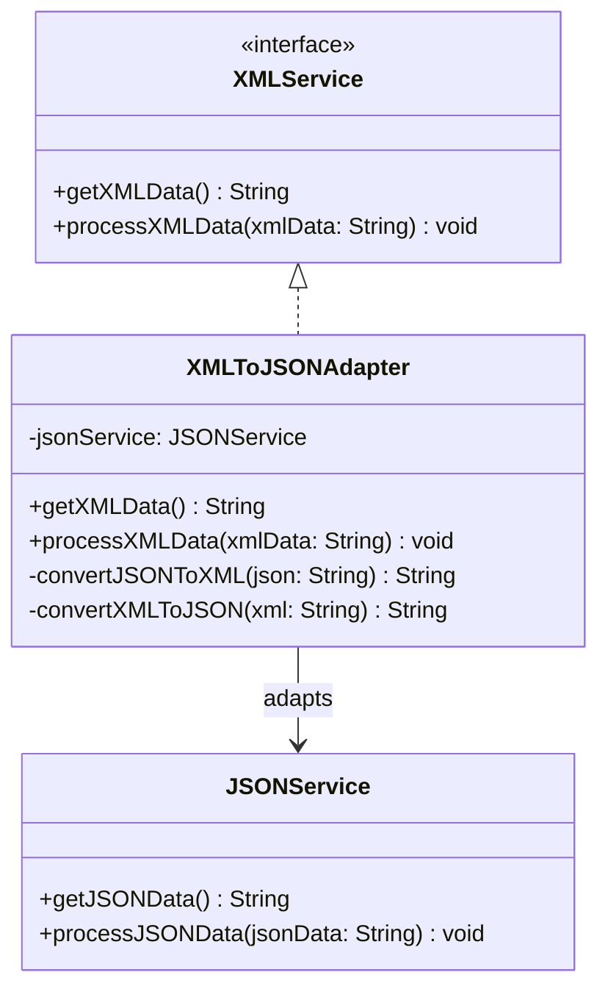

#### Files Structure

```
Tuan3/
└── Problem3_Adapter/
    ├── XMLService.java
    ├── JSONService.java
    ├── XMLToJSONAdapter.java
    └── AdapterDemo.java
```

---

### Library Management System (Main Project)

> Áp dụng 5 Design Patterns: Singleton, Factory Method, Strategy, Observer, Decorator

#### Architecture Overview

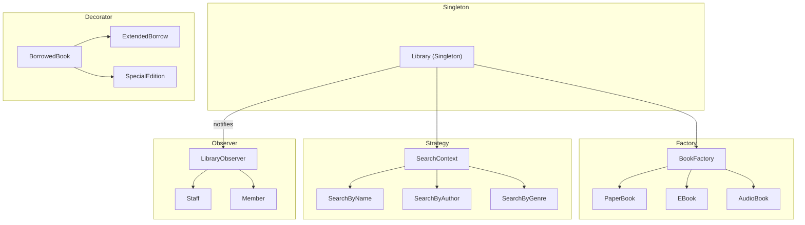

#### UML Diagram - Singleton Pattern

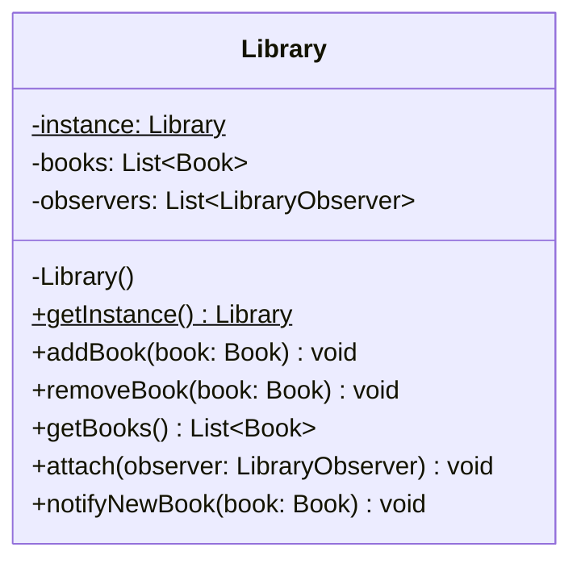

#### UML Diagram - Factory Method Pattern

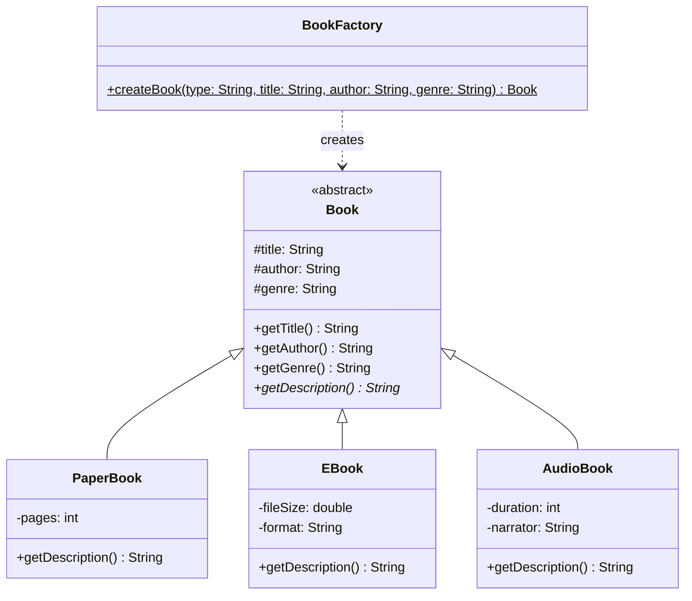

#### UML Diagram - Strategy Pattern

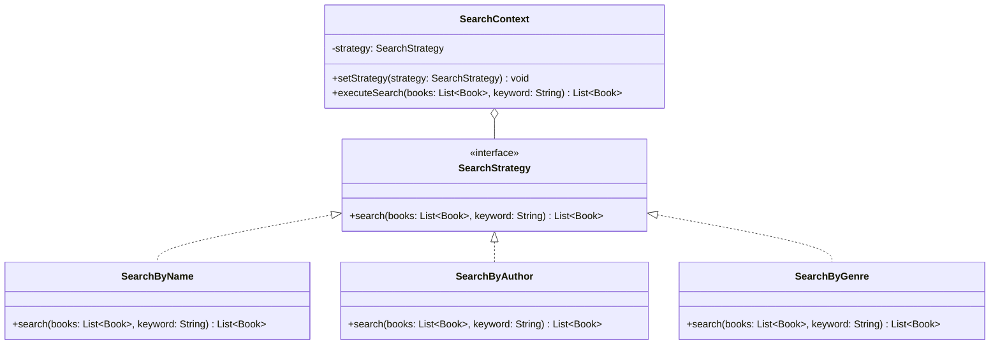

#### UML Diagram - Observer Pattern (Library)

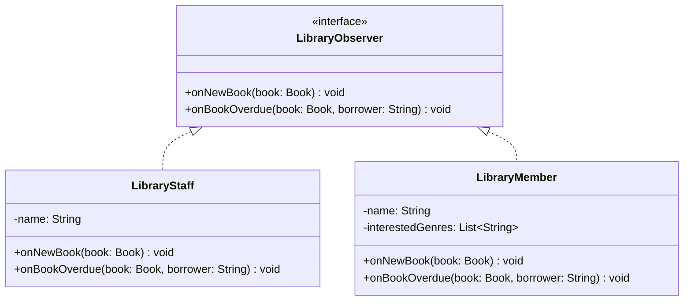

#### UML Diagram - Decorator Pattern

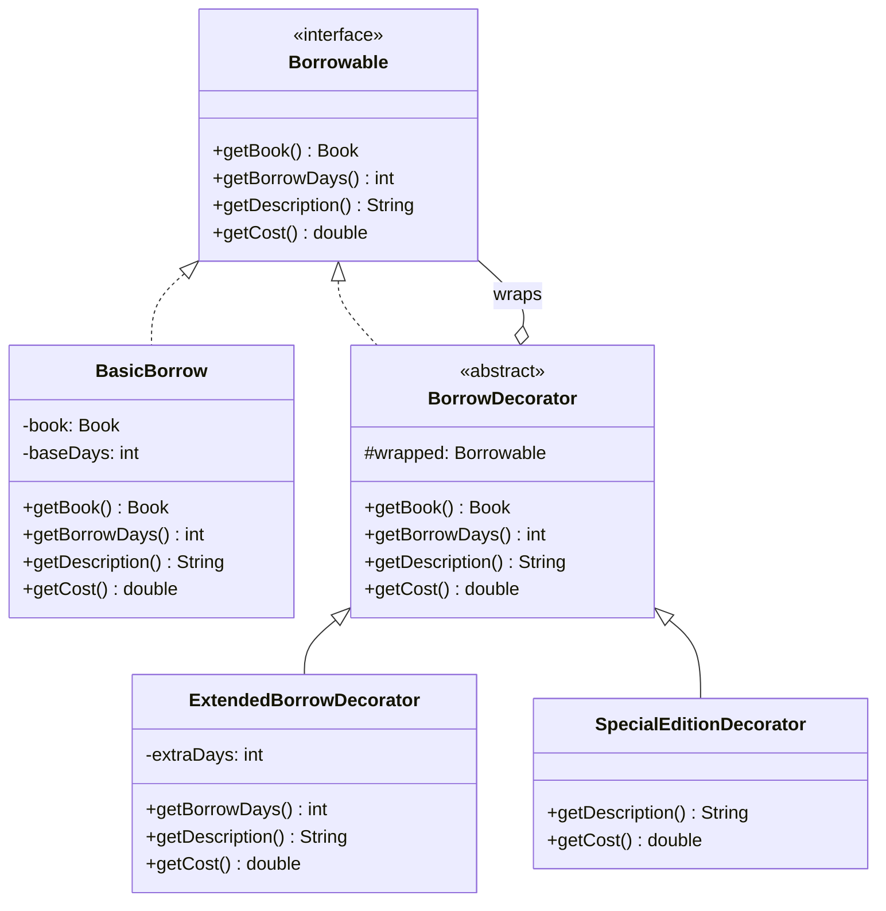

#### Files Structure

```
Tuan3/
└── LibraryManagement/
    ├── singleton/
    │   └── Library.java
    ├── factory/
    │   ├── Book.java
    │   ├── PaperBook.java
    │   ├── EBook.java
    │   ├── AudioBook.java
    │   └── BookFactory.java
    ├── strategy/
    │   ├── SearchStrategy.java
    │   ├── SearchByName.java
    │   ├── SearchByAuthor.java
    │   ├── SearchByGenre.java
    │   └── SearchContext.java
    ├── observer/
    │   ├── LibraryObserver.java
    │   ├── LibraryStaff.java
    │   └── LibraryMember.java
    ├── decorator/
    │   ├── Borrowable.java
    │   ├── BasicBorrow.java
    │   ├── BorrowDecorator.java
    │   ├── ExtendedBorrowDecorator.java
    │   └── SpecialEditionDecorator.java
    └── LibraryDemo.java
```

---

## Architectural Characteristics

| Characteristic | Applied In | Description |
|---------------|------------|-------------|
| **Modularity** | All patterns | Mỗi pattern được tổ chức trong package riêng |
| **Extensibility** | Factory, Strategy, Decorator | Dễ dàng thêm loại sách, chiến lược tìm kiếm, tính năng mượn mới |
| **Loose Coupling** | Observer, Adapter | Giảm sự phụ thuộc giữa các thành phần |
| **Single Responsibility** | All patterns | Mỗi class có một nhiệm vụ duy nhất |
| **Open/Closed** | All patterns | Mở rộng mà không cần sửa đổi code hiện tại |

---

## Verification Plan

### Automated Testing

Chạy file demo để kiểm tra từng pattern:

```bash
# Compile and run Problem 1 - Composite
cd d:/nam4\ hk2/KTTKPM/TH/Tuan3/Problem1_Composite
javac -d out filesystem/*.java ui/*.java CompositeDemo.java
java -cp out CompositeDemo

# Compile and run Problem 2 - Observer
cd d:/nam4\ hk2/KTTKPM/TH/Tuan3/Problem2_Observer
javac -d out stock/*.java task/*.java ObserverDemo.java
java -cp out ObserverDemo

# Compile and run Problem 3 - Adapter
cd d:/nam4\ hk2/KTTKPM/TH/Tuan3/Problem3_Adapter
javac -d out *.java
java -cp out AdapterDemo

# Compile and run Library Management System
cd d:/nam4\ hk2/KTTKPM/TH/Tuan3/LibraryManagement
javac -d out singleton/*.java factory/*.java strategy/*.java observer/*.java decorator/*.java LibraryDemo.java
java -cp out LibraryDemo
```

### Manual Verification

1. **Composite Pattern**: Kiểm tra cây thư mục hiển thị đúng cấu trúc, tổng kích thước folder đúng
2. **Observer Pattern**: Kiểm tra các observer nhận được thông báo khi subject thay đổi
3. **Adapter Pattern**: Kiểm tra chuyển đổi JSON ↔ XML thành công
4. **Library System**: Kiểm tra tất cả chức năng: thêm sách, tìm kiếm, mượn sách với decorator
